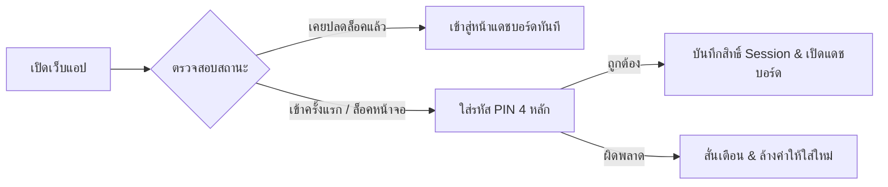

# คู่มือการใช้งานระบบแฟ้มสะสมผลงานและบันทึกการอบรมดิจิทัล
## (Public Sector Civil Servant Trainee Digital Portfolio - User Manual)

---

### 🌟 ยินดีต้อนรับสู่ระบบศูนย์บัญชาการการอบรมและแฟ้มผลงานดิจิทัล
ระบบนี้ได้รับการออกแบบขึ้นมาเป็นพิเศษสำหรับ **พี่แจ็ค (นายนิติพัฒน์ คุ้มวงษ์)** และผู้เข้าร่วมอบรมหลักสูตรเตรียมความพร้อมสำหรับการจ้างงานคนพิการในหน่วยงานภาครัฐ รุ่นที่ 1 เพื่อช่วยบริหารจัดการข้อมูลการเรียนรู้ 13 วัน ณ โรงแรมเซ็นทารา ไลฟ์ และการฝึกปฏิบัติงานจริง (OJT 90 ชม.) พร้อมระบบส่งออกเล่ม Portfolio มาตรฐานภาครัฐ 7 หน้าแบบอัตโนมัติ

---

## 📌 สารบัญคู่มือ (Table of Contents)
1. [ขั้นตอนที่ 1: การเข้าสู่ระบบและความปลอดภัย (Security Lock & PIN)](#1-การเข้าสู่ระบบและความปลอดภัย-security-lock--pin)
2. [ขั้นตอนที่ 2: การจัดการประวัติส่วนตัวและทำเนียบรุ่น 37 คน (M1)](#2-การจัดการประวัติส่วนตัวและทำเนียบรุ่น-37-คน-module-m1)
3. [ขั้นตอนที่ 3: ตารางอบรม 13 วันและศูนย์รวมการเรียนรู้ (M2)](#3-ตารางอบรม-13-วันและศูนย์รวมการเรียนรู้-module-m2)
4. [ขั้นตอนที่ 4: บันทึกและติดตามการฝึกปฏิบัติงานจริง OJT 90 ชม. (M3)](#4-บันทึกและติดตามการฝึกปฏิบัติงานจริง-ojt-90-ชม-module-m3)
5. [ขั้นตอนที่ 5: สตูดิโอปัญญาประดิษฐ์ AI Magic Polish & Prompts (M4)](#5-สตูดิโอปัญญาประดิษฐ์-ai-magic-polish--prompts-module-m4)
6. [ขั้นตอนที่ 6: คลังเอกสารและผลงานดิจิทัล (M5)](#6-คลังเอกสารและผลงานดิจิทัล-module-m5)
7. [ขั้นตอนที่ 7: การส่งออกเล่ม Portfolio 7 หน้า A4 (M6)](#7-การส่งออกเล่ม-portfolio-7-หน้า-a4-module-m6)
8. [ขั้นตอนที่ 8: การเข้าถึงที่เท่าเทียมและการสำรองข้อมูล (M7)](#8-การเข้าถึงที่เท่าเทียมและการสำรองข้อมูล-module-m7)

---

## 1. การเข้าสู่ระบบและความปลอดภัย (Security Lock & PIN)

* 🔑 **รหัส PIN เข้าใช้งาน:** ใส่รหัส PIN ความปลอดภัย 4 หลักที่ได้รับมอบหมายเพื่อยืนยันตัวตนก่อนเข้าใช้งาน
* 📱 **การปลดล็อคบน iPad / iPhone / Mac:** กดตัวเลขบนแป้นพิมพ์สัมผัสบนหน้าจอ 4 หลัก ระบบจะปลดล็อคเข้าสู่หน้าแดชบอร์ดทันทีโดยไม่มีการรีโหลดหน้าเว็บ
* 🔒 **การล็อคหน้าจอทันที:** กดปุ่ม **[ล็อคหน้าจอ]** ที่แถบเมนูด้านบน หรือในหน้า M7 เพื่อล็อคหน้าจอเมื่อต้องลุกออกจากโต๊ะทำงาน
* ⚙️ **การเปลี่ยนรหัสผ่าน PIN:** กดปุ่ม **[เปลี่ยนรหัส PIN]** ในหน้า M7 กรอกรหัสเดิมและรหัสใหม่ 4 หลักเพื่อตั้งรหัสส่วนตัว

---

## 2. การจัดการประวัติส่วนตัวและทำเนียบรุ่น 37 คน (Module M1)

### 2.1 ข้อมูลประวัติส่วนตัวและประสบการณ์ทำงาน (13 ปี)
* **ข้อมูลโปรไฟล์หลัก:** ชื่อ-นามสกุล, ตำแหน่งเป้าหมาย, สังกัด, อีเมล, เบอร์โทรศัพท์ และวิสัยทัศน์
* **ทักษะ Hard & Soft Skills:** ระบุทักษะความเชี่ยวชาญ (เช่น Database Management, SA, IT Security)
* **กล่องจัดการประวัติการทำงาน (Experience Manager):** กดปุ่ม **[+ เพิ่มประวัติการทำงาน]** เพื่อเพิ่มหรือแก้ไขประวัติการทำงาน 3 แห่ง (สภากาชาดไทย, กรมกิจการผู้สูงอายุ, World Entertainment Network) ซึ่งข้อมูลนี้จะถูกส่งไปแสดงผลใน **Portfolio หน้า 3** อัตโนมัติ

### 2.2 ทำเนียบผู้เข้าอบรม 37 คน (CRUD & 3 View Modes)
* 📋 **ตาราง (Table Mode):** ดูรายชื่อทั้งหมด 37 คน พร้อมเลขบัตร (CARD-001 ถึง CARD-037), รหัสหลักสูตร (ADV-01 ถึง 16 และ FND-01 ถึง 21), จังหวัด, และสิ่งที่สนใจ
* 🪪 **การ์ดโปรไฟล์ (Card Mode):** แสดงโปรไฟล์การ์ดแบบกราฟิกสวยงาม แยกสีตามสายหลักสูตร
* 📊 **กราฟสถิติ (Analytics Mode):** วิเคราะห์ผู้เข้าอบรมด้วย Chart.js จำแนกตาม 6 หมวดหมู่ความสนใจ และสัดส่วน 2 สายหลักสูตร
* ✨ **Gemini AI Features:**
  * **[✨ วิเคราะห์สายงาน]:** กดปุ่มที่การ์ดเพื่อนเพื่อวิเคราะห์โอกาสงานภาครัฐและ OJT ที่เหมาะสม
  * **[✨ ขัดเกลาความสนใจ]:** ช่วยเรียบเรียงความคาดหวังให้เป็นภาษาราชการมืออาชีพ
  * **[✨ สรุปรายงานผู้บริหาร]:** ประมวลผลภาพรวม 37 คน ออกมาเป็นรายงานสรุปสำหรับเสนอผู้บังคับบัญชา

---

## 3. ตารางอบรม 13 วันและศูนย์รวมการเรียนรู้ (Module M2)

* 📅 **สถานที่:** โรงแรมเซ็นทารา ไลฟ์ ศูนย์ราชการและคอนเวนชันเซ็นเตอร์ แจ้งวัฒนะ กรุงเทพฯ (ห้อง BB 203, BB 211, BB 212, BB 204, BB 205)
* 🔘 **ตัวกรองสายวิชา:**
  * `อัตโนมัติตามโปรไฟล์` / `สายขั้นสูง (ADV)` / `สายพื้นฐาน (FND)` / `เทียบเคียง 2 หลักสูตร`
* 🎯 **ศูนย์รวมกิจกรรม Daily Action Hub:** ในแต่ละวันสามารถกด:
  * 📝 **[ทำ Pre-test] / [ทำ Post-test]:** บันทึกคะแนนทดสอบก่อน-หลังเรียน
  * 📥 **[เปิดสไลด์]:** ดาวน์โหลดเอกสารและสไลด์ประกอบการบรรยาย
  * ✍️ **[บันทึกสรุป]:** สรุปสิ่งที่ได้เรียนรู้และแผนนำไปประยุกต์ใช้
  * 📊 **[ประเมิน]:** บันทึกสถานะการส่งแบบประเมินความพึงพอใจ

---

## 4. บันทึกและติดตามการฝึกปฏิบัติงานจริง OJT 90 ชม. (Module M3)

* 🗓️ **กำหนดการ:** **กันยายน 2569 (เดือนหน้า)**
* ⏱️ **เกณฑ์มาตรฐาน:** สะสมเวลาฝึกปฏิบัติงานจริงให้ครบอย่างน้อย **90 ชั่วโมง** ครอบคลุมทั้ง 4 มิติ:
  1. **ด้านที่ 1:** งานวิเคราะห์ข้อมูลและสารสนเทศ (Data Analysis)
  2. **ด้านที่ 2:** งานเอกสารราชการและสารบรรณ (Official Documentation)
  3. **ด้านที่ 3:** งานเทคนิค ระบบ และการพัฒนา (Technical & Development)
  4. **ด้านที่ 4:** งานประสานงาน บริการ และสื่อสาร (Coordination & Public Service)
* 📋 **OJT Checklist (6 รายการ):** ระบบเช็คความพร้อมเอกสารเพื่อเบิกจ่ายเบี้ยเลี้ยง

---

## 5. สตูดิโอปัญญาประดิษฐ์ AI Magic Polish & Prompts (Module M4)

* 🪄 **AI Magic Polish:** พิมพ์ข้อความหรือพูดด้วยเสียง แล้วกดขัดเกลาเป็นภาษาราชการ 3 โหมด (ภาษาทางการ, สรุปกระชับ, เชิงอภิปรายผล)
* 🎬 **Video Script 1 นาที:** สร้างสคริปต์สำหรับอัดคลิปวิดีโอแนะนำตนเอง 60 วินาที
* 📐 **R-C-T-F Prompt Builder:** โครงสร้าง Prompt ระดับสูง 4 องค์ประกอบ:
  * **Role (บทบาท):** กำหนดสถานะของ AI
  * **Context (บริบท):** ระเบียบภาครัฐและเงื่อนไข
  * **Task (ภารกิจ):** คำสั่งที่ต้องการให้ทำ
  * **Format (รูปแบบ):** โครงสร้างผลลัพธ์ เช่น บันทึกข้อความ 3 ย่อหน้า

---

## 6. คลังเอกสารและผลงานดิจิทัล (Module M5)

* 📁 บันทึกและจัดหมวดหมู่ลิงก์ Google Drive, รูปภาพกิจกรรม, เกียรติบัตร และเอกสารโครงงาน
* ♿ **Mandatory Alt-Text:** ระบบบังคับใส่คำบรรยายภาพสำหรับผู้พิการทางสายตา (Screen Readers) ตามมาตรฐาน WCAG 2.1 AA

---

## 7. การส่งออกเล่ม Portfolio 7 หน้า A4 (Module M6)

ระบบประกอบเล่มแฟ้มสะสมผลงาน 7 หน้าขนาด A4 แบบ Real-time:
* **หน้า 1:** ปกหน้า (ชื่อ นายนิติพัฒน์ คุ้มวงษ์, สายหลักสูตร, ตำแหน่ง, ประสบการณ์ 13 ปี)
* **หน้า 2:** ประวัติส่วนตัวและวิสัยทัศน์การปฏิบัติหน้าที่ราชการ
* **หน้า 3:** ประวัติการทำงานและผลงานที่ผ่านมา 3 แห่ง
* **หน้า 4:** ทักษะความเชี่ยวชาญ Hard & Soft Skills
* **หน้า 5:** สรุปผลการเรียนรู้ 13 วัน ณ เซ็นทารา ไลฟ์ (สถิติเข้าเรียน + คะแนน Pre/Post-test)
* **หน้า 6:** รายงานผลการฝึกปฏิบัติงานจริง OJT ครบ 4 ด้าน
* **หน้า 7:** แผนการพัฒนาตนเอง ความมุ่งมั่น และจุดลงนามรับรองเอกสาร
* 🖨️ **การสั่งพิมพ์:** กดปุ่ม **[สั่งพิมพ์ PDF (A4 7 หน้า)]** เพื่อบันทึกเป็นไฟล์ PDF คมชัดสูง

---

## 8. การเข้าถึงที่เท่าเทียมและการสำรองข้อมูล (Module M7)

* 🎨 **ระบบธีม:** รองรับ **High Contrast (ดำ-เหลือง คมชัดสูง > 7:1)** สำหรับผู้มีสายตาเลือนราง
* 🔤 **ขนาดตัวอักษร:** ปรับได้ 3 ระดับ (ปกติ, ใหญ่, ใหญ่พิเศษ)
* 🎙️ **พิมพ์ด้วยเสียง (Voice Input):** กดปุ่มรูปไมโครโฟนสีแดง เพื่อพูดภาษาไทยและให้ระบบพิมพ์ลงในช่องข้อความอัตโนมัติ
* 💾 **การสำรองข้อมูล (Local-First Data Ownership):**
  * **[สำรอง JSON]:** ดาวน์โหลดไฟล์ข้อมูลทั้งหมดเก็บไว้ในเครื่องหรือ Google Drive
  * **[นำเข้า JSON]:** นำไฟล์สำรองกลับมาเปิดใช้งานได้ทุกอุปกรณ์
  * **[รีเซ็ตข้อมูล]:** ล้างข้อมูลกลับเป็นค่าเริ่มต้น

---

### 🌐 ลิงก์เข้าใช้งานระบบ:
👉 **[https://carinojake.github.io/civil-servant-trainee-portfolio/](https://carinojake.github.io/civil-servant-trainee-portfolio/)**
