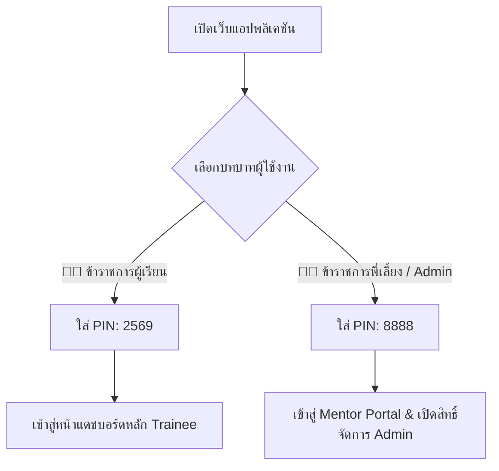

# คู่มือการใช้งานระบบแฟ้มสะสมผลงานและบันทึกการอบรมดิจิทัล
## (Public Sector Civil Servant Trainee Digital Portfolio - User Manual v2.9.2)

---

### 🌟 ยินดีต้อนรับสู่ระบบศูนย์บัญชาการการอบรมและแฟ้มผลงานดิจิทัล
ระบบนี้ได้รับการออกแบบขึ้นมาเป็นพิเศษสำหรับ **พี่แจ็ค (นายนิติพัฒน์ คุ้มวงษ์)** และผู้เข้าร่วมอบรมหลักสูตรเตรียมความพร้อมสำหรับการจ้างงานคนพิการในหน่วยงานภาครัฐ รุ่นที่ 1 เพื่อช่วยบริหารจัดการข้อมูลการเรียนรู้ 13 วัน ณ โรงแรมเซ็นทารา ไลฟ์ และการฝึกปฏิบัติงานจริง (OJT 90 ชม.) พร้อมระบบส่งออกเล่ม Portfolio มาตรฐานภาครัฐ 7 หน้าแบบอัตโนมัติ

---

## 📌 สารบัญคู่มือ (Table of Contents)
1. [ขั้นตอนที่ 1: การเข้าสู่ระบบและความปลอดภัย 2 บทบาท (Trainee vs Mentor / Admin PIN)](#1-การเข้าสู่ระบบและความปลอดภัย-security-lock--pin)
2. [ขั้นตอนที่ 2: การจัดการประวัติส่วนตัวและทำเนียบรุ่น 37 คน (Module M1)](#2-การจัดการประวัติส่วนตัวและทำเนียบรุ่น-37-คน-module-m1)
3. [ขั้นตอนที่ 3: ตารางอบรม 13 วัน & ศูนย์รวมการเรียนรู้รายวัน (Module M2)](#3-ตารางอบรม-13-วันและศูนย์รวมการเรียนรู้-module-m2)
4. [ขั้นตอนที่ 4: บันทึกและติดตามการฝึกปฏิบัติงานจริง OJT 90 ชม. (Module M3)](#4-บันทึกและติดตามการฝึกปฏิบัติงานจริง-ojt-90-ชม-module-m3)
5. [ขั้นตอนที่ 5: สตูดิโอปัญญาประดิษฐ์ AI Magic Polish & Prompts (Module M4)](#5-สตูดิโอปัญญาประดิษฐ์-ai-magic-polish--prompts-module-m4)
6. [ขั้นตอนที่ 6: คลังเอกสาร สไลด์บรรยาย 13 วัน & Google Drive (Module M5)](#6-คลังเอกสาร-สไลด์บรรยาย-13-วัน--google-drive-module-m5)
7. [ขั้นตอนที่ 7: การส่งออกเล่ม Portfolio 7 หน้า A4 & ตราประทับคู่ (Module M6)](#7-การส่งออกเล่ม-portfolio-7-หน้า-a4-module-m6)
8. [ขั้นตอนที่ 8: การเข้าถึงที่เท่าเทียมและการสำรองข้อมูล (Module M7)](#8-การเข้าถึงที่เท่าเทียมและการสำรองข้อมูล-module-m7)
9. [ขั้นตอนที่ 9: คลังข้อสอบอัจฉริยะ & AI Study Buddy (Module M8)](#9-คลังข้อสอบอัจฉริยะ--ai-study-buddy-module-m8)
10. [ขั้นตอนที่ 10: ทำเนียบวิทยากร 17 ท่าน & Traceability Matrix (Module M9)](#10-ทำเนียบวิทยากร-17-ท่าน--traceability-matrix-module-m9)
11. [ขั้นตอนที่ 11: การจัดการไฟล์และเพิ่มอาจารย์ใหม่ (Admin & AI Assistant)](#11-การจัดการไฟล์และเพิ่มอาจารย์ใหม่-admin--ai-assistant)

---

## 1. การเข้าสู่ระบบและความปลอดภัย (Security Lock & PIN)

* 🔑 **รหัส PIN ข้าราชการผู้เรียน (Trainee):** `2569` สำหรับผู้เข้าอบรมดูข้อมูลและบันทึกคะแนนส่วนตัว
* 👨‍🏫 **รหัส PIN ข้าราชการพี่เลี้ยง / Admin (Mentor):** `8888` ปลดล็อกแถบพี่เลี้ยง, ฟอร์มประเมินสมรรถนะ 6 ด้าน, ตราประทับรับรอง และปุ่มจัดการไฟล์/อาจารย์ใหม่
* 📱 **การปลดล็อคด่วน (Magic Link):** เข้าสู่ระบบผ่าน URL `?role=mentor` ระบบจะล็อกอินโหมดพี่เลี้ยงให้อัตโนมัติ
* 🔒 **การล็อคหน้าจอทันที:** กดปุ่ม **[ล็อคหน้าจอ]** ที่แถบเมนูด้านบน เมื่อต้องลุกออกจากโต๊ะทำงาน

---

## 2. การจัดการประวัติส่วนตัวและทำเนียบรุ่น 37 คน (Module M1)

* **ข้อมูลโปรไฟล์หลัก:** ชื่อ-นามสกุล, ตำแหน่งเป้าหมาย, สังกัด, อีเมล, เบอร์โทรศัพท์ และวิสัยทัศน์
* **ทักษะ Hard & Soft Skills:** ระบุทักษะความเชี่ยวชาญ (เช่น Database Management, SA, IT Security)
* **กล่องจัดการประวัติการทำงาน (Experience Manager):** กดปุ่ม **[+ เพิ่มประวัติการทำงาน]** เพื่อเพิ่มหรือแก้ไขประวัติการทำงาน 3 แห่ง (สภากาชาดไทย, กรมกิจการผู้สูงอายุ, World Entertainment Network)
* **ทำเนียบผู้เข้าอบรม 37 คน:**
  * 📋 **ตาราง (Table Mode):** แสดงข้อมูลผู้เข้าอบรมครบทั้ง 37 คน
  * 🪪 **การ์ดโปรไฟล์ (Card Mode):** การ์ดกราฟิกสวยงาม แยกสาย ADV / FND
  * 📊 **กราฟสถิติ (Analytics Mode):** วิเคราะห์สถิติความสนใจและกลุ่มจังหวัด

---

## 3. ตารางอบรม 13 วันและศูนย์รวมการเรียนรู้ (Module M2)

* 📅 **สถานที่:** โรงแรมเซ็นทารา ไลฟ์ ศูนย์ราชการและคอนเวนชันเซ็นเตอร์ แจ้งวัฒนะ (BB 202, BB 203, BB 204, BB 205, BB 212)
* 📁 **Quick Action Google Drive:** กดปุ่ม **`[📁 โฟลเดอร์ Google Drive รวม]`** เพื่อเปิดคลังเอกสารทั้งหมดทันที
* 🎯 **Daily Action Hub:**
  * 📝 **[ทำ Pre-test] / [ทำ Post-test]:** บันทึกคะแนนทดสอบก่อน-หลังเรียน
  * 📄 **[เปิดสไลด์เช้า] / [เปิดสไลด์บ่าย]:** ดาวน์โหลดเอกสารและสไลด์แยกช่วงเวลา
  * ✍️ **[บันทึกสรุป]:** สรุปสิ่งที่ได้เรียนรู้และแผนนำไปประยุกต์ใช้

---

## 4. บันทึกและติดตามการฝึกปฏิบัติงานจริง OJT 90 ชม. (Module M3)

* 🗓️ **กำหนดการ:** **กันยายน 2569**
* ⏱️ **เกณฑ์มาตรฐาน:** สะสมเวลาฝึกปฏิบัติงานจริงให้ครบอย่างน้อย **90 ชั่วโมง** ครอบคลุมทั้ง 4 มิติ:
  1. **ด้านที่ 1:** งานวิเคราะห์ข้อมูลและสารสนเทศ (Data Analysis)
  2. **ด้านที่ 2:** งานเอกสารราชการและสารบรรณ (Official Documentation)
  3. **ด้านที่ 3:** งานเทคนิค ระบบ และการพัฒนา (Technical & Development)
  4. **ด้านที่ 4:** งานประสานงาน บริการ และสื่อสาร (Coordination & Public Service)
* 📋 **OJT Checklist (6 รายการ):** ระบบเช็คความพร้อมเอกสารเพื่อเบิกจ่ายเบี้ยเลี้ยง

---

## 5. สตูดิโอปัญญาประดิษฐ์ AI Magic Polish & Prompts (Module M4)

* 🪄 **AI Magic Polish:** ขัดเกลาข้อความเป็นภาษาราชการ 3 โหมด
* 🎬 **Video Script 1 นาที:** สร้างสคริปต์วิดีโอแนะนำตนเอง 60 วินาที
* 📐 **R-C-T-F Prompt Builder:** โครงสร้าง Prompt ระดับสูง (Role, Context, Task, Format)

---

## 6. คลังเอกสาร สไลด์บรรยาย 13 วัน & Google Drive (Module M5)

* 📁 **Google Drive Storage:** ลิงก์ตรงไปยัง `https://drive.google.com/drive/folders/1NKpmB-N9p4tTS4g72aLKhsC9lGPSEK7h`
* 📚 **13-Day Slides Hub:** คลังสไลด์บรรยายทั้ง 13 วัน พร้อมระบบค้นหา และปุ่ม **`[✨ สรุปประเด็นด้วย AI]`**
* ♿ **Mandatory Alt-Text:** ระบบบังคับใส่คำบรรยายภาพสำหรับผู้พิการทางสายตาตามมาตรฐาน WCAG 2.1 AA

---

## 7. การส่งออกเล่ม Portfolio 7 หน้า A4 & ตราประทับคู่ (Module M6)

ระบบประกอบเล่มแฟ้มสะสมผลงาน 7 หน้าขนาด A4 แบบ Real-time:
* **หน้า 1:** ปกหน้า (ชื่อ นายนิติพัฒน์ คุ้มวงษ์, สายหลักสูตร, ประสบการณ์ 13 ปี)
* **หน้า 2:** ประวัติส่วนตัวและวิสัยทัศน์การปฏิบัติหน้าที่ราชการ
* **หน้า 3:** ประวัติการทำงานและผลงานที่ผ่านมา 3 แห่ง
* **หน้า 4:** ทักษะความเชี่ยวชาญ Hard & Soft Skills
* **หน้า 5:** สรุปผลการเรียนรู้ 13 วัน ณ เซ็นทารา ไลฟ์
* **หน้า 6:** รายงานผลการฝึกปฏิบัติงานจริง OJT ครบ 4 ด้าน
* **หน้า 7:** แผนการพัฒนาตนเอง พร้อม **ตราประทับรับรองคู่ (Dual Endorsement Seal)** จากผู้เรียนและข้าราชการพี่เลี้ยง
* 🖨️ **การสั่งพิมพ์:** กดปุ่ม **[สั่งพิมพ์ PDF (A4 7 หน้า)]** เพื่อบันทึกเป็นไฟล์ PDF คมชัดสูง

---

## 8. การเข้าถึงที่เท่าเทียมและการสำรองข้อมูล (Module M7)

* 🎨 **ระบบธีม:** รองรับ **High Contrast (ดำ-เหลือง คมชัดสูง > 7:1)**
* 🔤 **ขนาดตัวอักษร:** ปรับได้ 3 ระดับ (ปกติ, ใหญ่, ใหญ่พิเศษ)
* 🎙️ **พิมพ์ด้วยเสียง (Voice Input):** พูดภาษาไทยและให้ระบบพิมพ์ลงในช่องข้อความอัตโนมัติ
* 💾 **การสำรองข้อมูล (Local-First Data Ownership):** สำรอง JSON, นำเข้า JSON และรีเซ็ตข้อมูล

---

## 9. คลังข้อสอบอัจฉริยะ & AI Study Buddy (Module M8)

* 🧠 **Civil Service Quiz Engine:** คลังข้อสอบราชการ 15 ข้อ ครอบคลุม 5 หมวด (สารบรรณ 3 ย่อหน้า, วินัย/จริยธรรม, PDPA, OJT 4 ด้าน, AI ภาครัฐ) พร้อมเฉลยละเอียดและเทคนิคจำ
* 💬 **AI Study Buddy Drawer (น้องฟ้า):** หน้าต่างแชตอัจฉริยะสำหรับติวสอบ, ตอบข้อสงสัย, และอ่านออกเสียงภาษาไทย (Thai TTS)

---

## 10. ทำเนียบวิทยากร 17 ท่าน & Traceability Matrix (Module M9)

* 👥 **ทำเนียบวิทยากร 17 ท่าน:** ค้นหาตามชื่อ สังกัด และความเชี่ยวชาญ 8 หมวดหมู่
* 🔀 **ระบบจัดเรียง 3 รูปแบบ:** เรียงตามรหัส `01-17`, เรียงตามชื่อ `ก-ฮ`, และเรียงตาม `วันที่สอนหลัก`
* 🗺️ **Traceability Matrix:** แผนที่ตรวจสอบย้อนหลัง 13 วัน เชื่อมโยง **"วัน - เวลา - วิชา - อาจารย์ - ไฟล์สไลด์ - สถานะยืนยัน"**

---

## 11. การจัดการไฟล์และเพิ่มอาจารย์ใหม่ (Admin & AI Assistant)

* ⚙️ **การเพิ่ม/จัดการไฟล์สไลด์ (M2, M5):**
  1. เข้าสู่ระบบด้วย PIN พี่เลี้ยง `8888`
  2. กดปุ่ม **`[⚙️ จัดการ/เพิ่มไฟล์เอกสาร]`**
  3. เลือกวันที่ 1-13 และช่วงเวลา (เช้า/บ่าย) แล้ววางลิงก์ Google Drive
* 👨‍🏫 **การเพิ่มอาจารย์ท่านใหม่ (M9):**
  1. ไปที่แท็บ M9 แล้วกดปุ่มสีเขียว **`[+ เพิ่มวิทยากรใหม่]`**
  2. กรอกชื่อ-สกุล, ตำแหน่ง, สังกัด, วันที่สอน, ความเชี่ยวชาญ และเลือกโทนสี
  3. กดบันทึก ระบบจะรันรหัส ID และเพิ่มเข้าสู่ทำเนียบทันที
* 🤖 **สั่งงานผ่าน AI Chat:** พิมพ์บอกน้องฟ้าในช่องแชต เช่น *"เพิ่มอาจารย์..."* หรือ *"เพิ่มไฟล์สไลด์..."* ได้ตลอดเวลา

---

### 🌐 ลิงก์เข้าใช้งานระบบ:
👉 **[https://carinojake.github.io/civil-servant-trainee-portfolio/](https://carinojake.github.io/civil-servant-trainee-portfolio/)**
